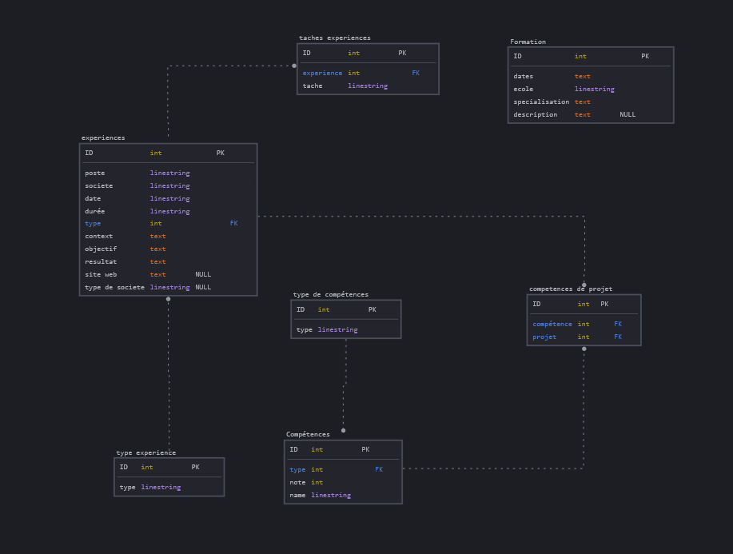

# Base de données - CV PostgreSQL

Ce dossier contient la configuration et les scripts nécessaires pour initialiser et gérer la base de données utilisée dans le projet **CV / Portfolio**.

## Objectif

La base de données est conçue pour stocker et gérer des informations liées :
- Aux expériences professionnelles
- Aux formations
- Aux compétences
- Aux projets personnels

## Stack technique

- **PostgreSQL 16**
- **Docker + Docker Compose**

## 🚀 Démarrage rapide

Lancez la base de données avec :

```bash
docker-compose up -d
```

Elle sera disponible sur `localhost:5433`.

---

## Structure des fichiers

- `docker-compose.yml` : configuration Docker pour lancer PostgreSQL.
- `db-init/` :
  - `01-data.sql` : insertion des données de test
  - `02-clean.sql` : script de nettoyage
  - `03-cv.sql` : création des tables
- `tables.png` : représentation graphique du schéma de la base
- `teste.sql` : script de test manuels ou de requêtes manuelles
- `notes.txt` : notes diverses liées à la base de données

---

## Schéma relationnel

Voici une vue d’ensemble de la structure relationnelle de la base de données :



---

## Explication du fonctionnement

### Principales entités :

- **experiences** : stocke les différentes expériences avec tous les détails liés (poste, entreprise, durée, etc.).
- **formation** : historique des formations suivies.
- **competences** : toutes les compétences disponibles, reliées à des projets.
- **type_experience / type_de_competences** : tables de typage (permet de catégoriser les expériences et compétences).
- **taches_experiences** : permet de lister les tâches réalisées lors d’une expérience.
- **competences_de_projet** : relie une compétence à un projet spécifique.

---

##  Réseau Docker

Le service `db` est connecté au réseau Docker nommé `cv-reseau`. Cela permet au front ou au backend d’accéder à la base via ce réseau Docker.

---

##  Connexion à la base

- **Utilisateur** : `samuel`
- **Mot de passe** : `iwantmyjob`
- **Base de données** : `CvData`
- **Port exposé** : `5433`


